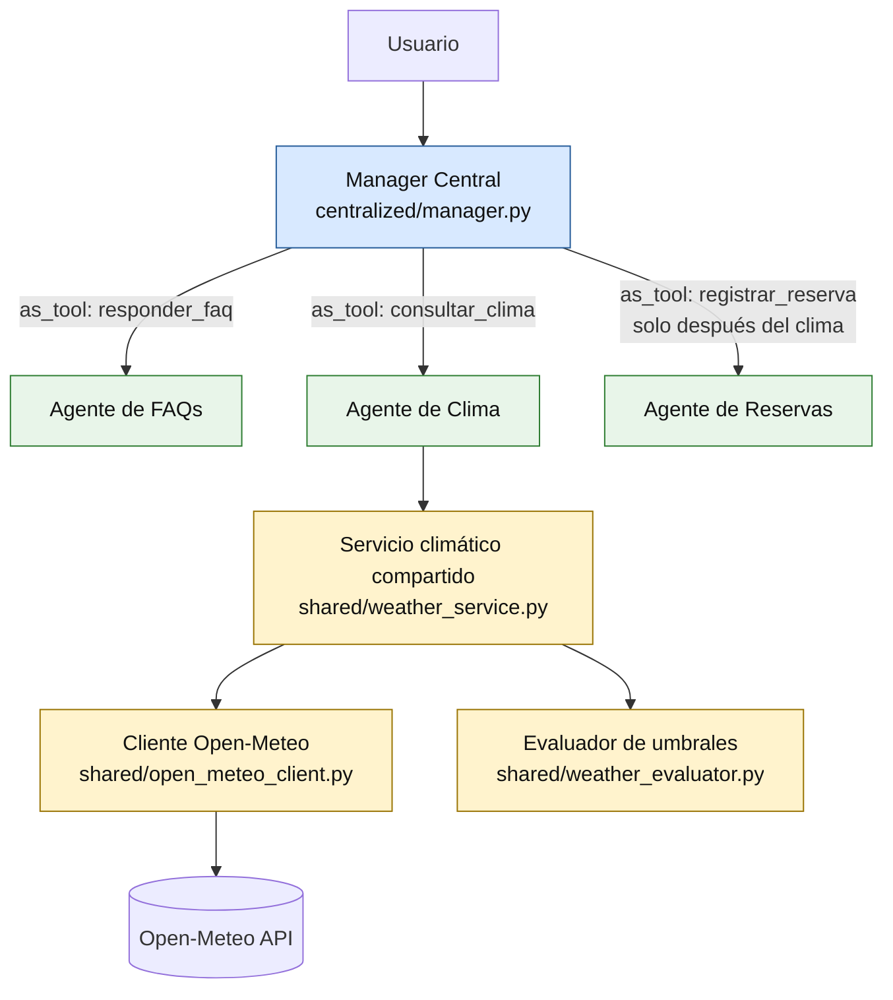

# Diagrama — Arquitectura centralizada

El Manager Central conserva el control de la conversación. Los agentes
especializados se exponen mediante `Agent.as_tool()` y devuelven su resultado
al manager. La regla “consultar clima antes de reservar” reside en un solo
lugar: las instrucciones del manager.

FAQs y almacenamiento de reservas son implementaciones provisionales para que
el programa sea ejecutable; el Integrante 3 podrá sustituirlas por sus módulos
definitivos sin cambiar el cliente climático ni el evaluador.
