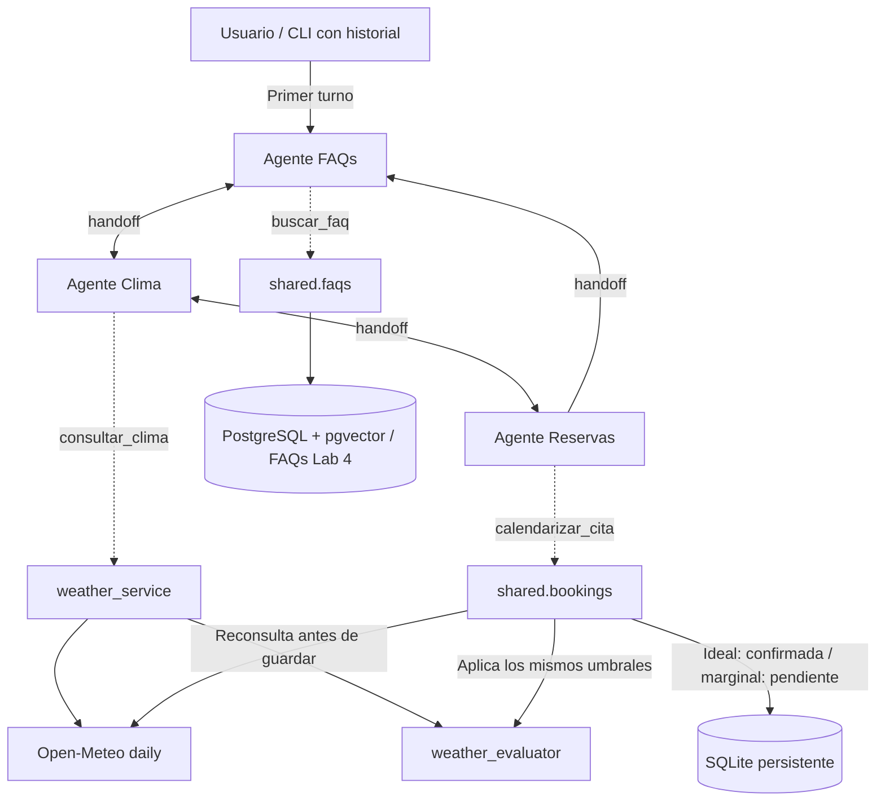
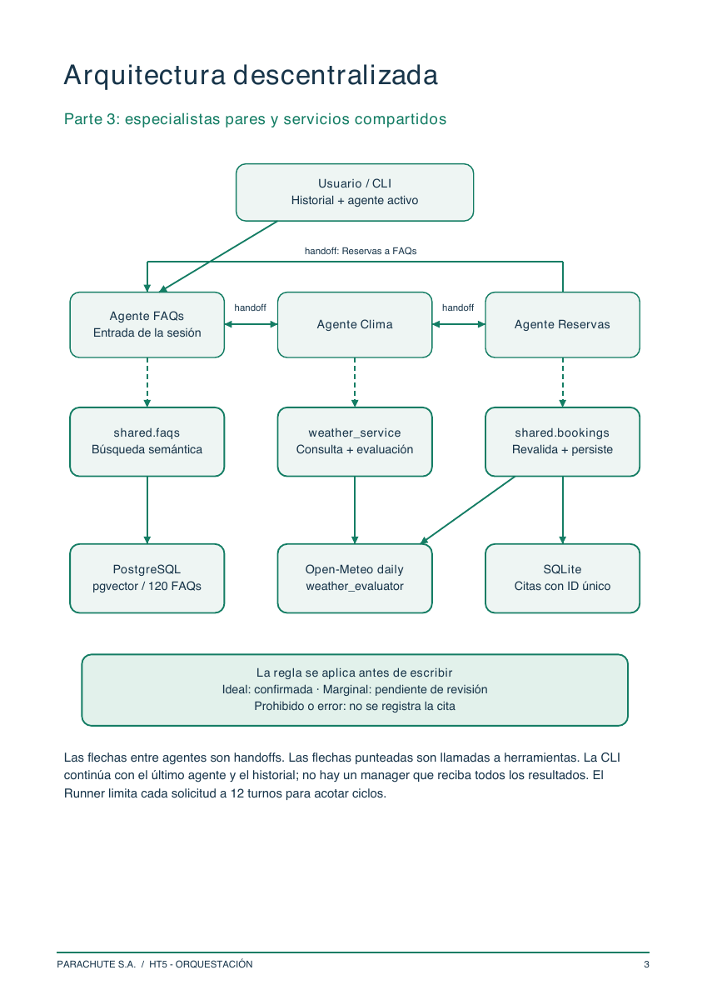

# Arquitectura descentralizada — Integrante 3

Las flechas `handoff` transfieren el control entre agentes pares. Las flechas
punteadas son llamadas a funciones, no a otros agentes. No existe manager ni
uso de `as_tool()` en esta arquitectura. Tras el primer turno, la CLI continúa
con `last_agent` y el historial; cualquier agente activo puede contestar al usuario.

La condición climática se vuelve a verificar en `shared.bookings` antes de
escribir, independientemente de la ruta de handoffs. Prohibido o error no crea
una cita. El límite de 12 turnos del Runner acota ciclos de transferencias.

