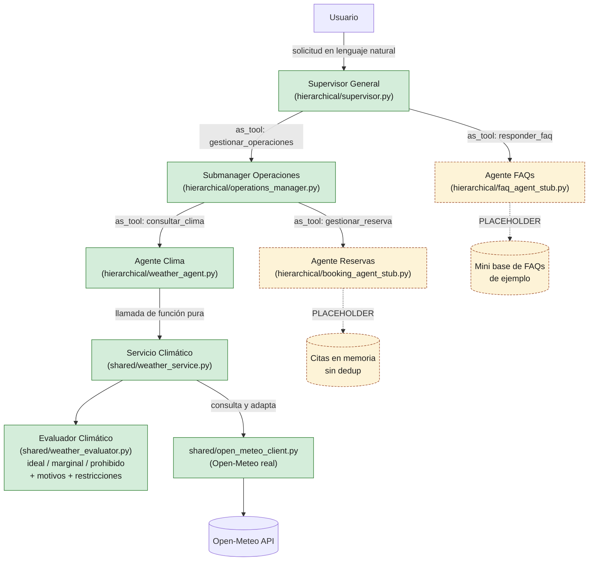

# Diagrama — Arquitectura jerárquica (Integrante 2)

Este diagrama corresponde al código en `hierarchical/` y `shared/`. Las líneas
continuas son relaciones de delegación implementadas con `Agent.as_tool()`.
FAQs y reservas siguen provisionales hasta la entrega del Integrante 3; la
integración real con Open-Meteo ya está conectada mediante el módulo común.



## Equivalente en texto (por si no se renderiza Mermaid)

```
                              Usuario
                                 │
                                 ▼
                       Supervisor General                         ← mi entrega
                        /                \
             as_tool: responder_faq   as_tool: gestionar_operaciones
                      /                        \
                     ▼                          ▼
              Agente FAQs              Submanager Operaciones      ← mi entrega
            (placeholder Lab4)          /                  \
                                as_tool: consultar_clima   as_tool: gestionar_reserva
                                       /                          \
                                      ▼                            ▼
                              Agente Clima                 Agente Reservas
                             (mi entrega)                  (placeholder)
                                   │
                      llamada de función pura
                                   │
                                   ▼
                     Evaluador Climático (shared/weather_evaluator.py)   ← mi entrega
                     ideal / marginal / prohibido + motivos + restricciones
                                   ▲
                                   │ obtiene WeatherReading
                                   │
                     shared/open_meteo_client.py (Open-Meteo real)
```

## Puntos clave que el diagrama hace evidentes

1. **Jerarquía de dos niveles real**: el Supervisor General nunca llama
   directamente a Clima o Reservas — siempre pasa por el Submanager de
   Operaciones. No hay una arquitectura centralizada disfrazada.
2. **Sin handoffs**: todas las flechas de delegación son `Agent.as_tool()`
   (el agente que delega mantiene el control de la conversación), no
   `handoff` (que transferiría el control). Esto distingue la arquitectura
   jerárquica de la descentralizada del Integrante 3.
3. **El Evaluador Climático es un módulo compartido, no un agente**: no
   aparece como nodo con `as_tool()` porque no es un agente — es una
   función pura (`evaluate_weather`) que el Agente Clima invoca
   directamente. Esto es lo que permite reutilizarlo sin cambios en las
   arquitecturas centralizada y descentralizada.
4. **Componentes provisionales claramente marcados** (punteados): el
   proveedor climático, el agente de FAQs y el agente de reservas son
   placeholders mínimos que existen solo para poder demostrar el flujo
   completo mientras Integrante 1 e Integrante 3 no entregan sus partes.
